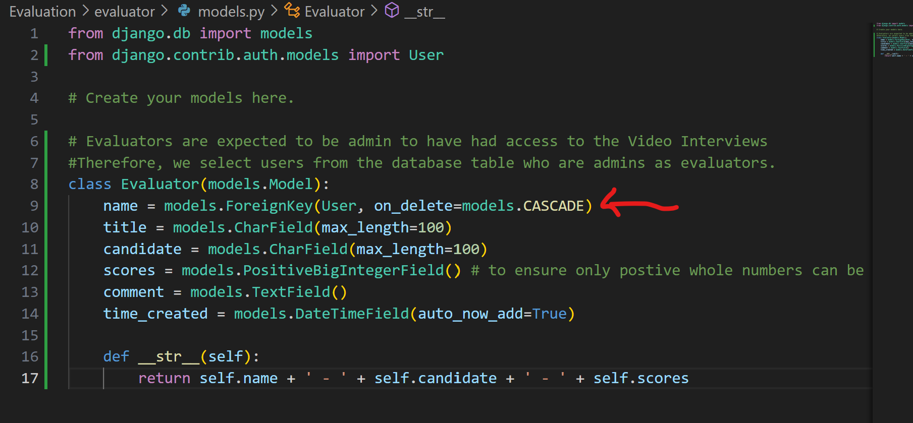
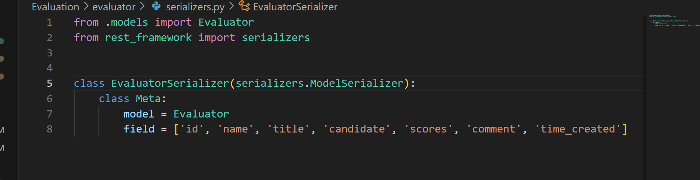
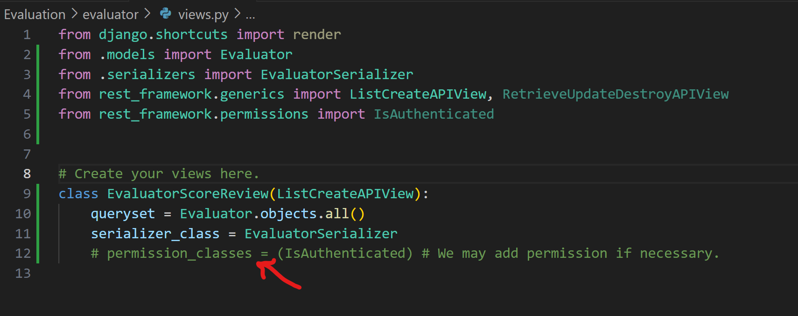
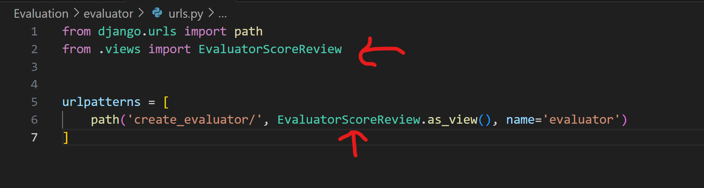
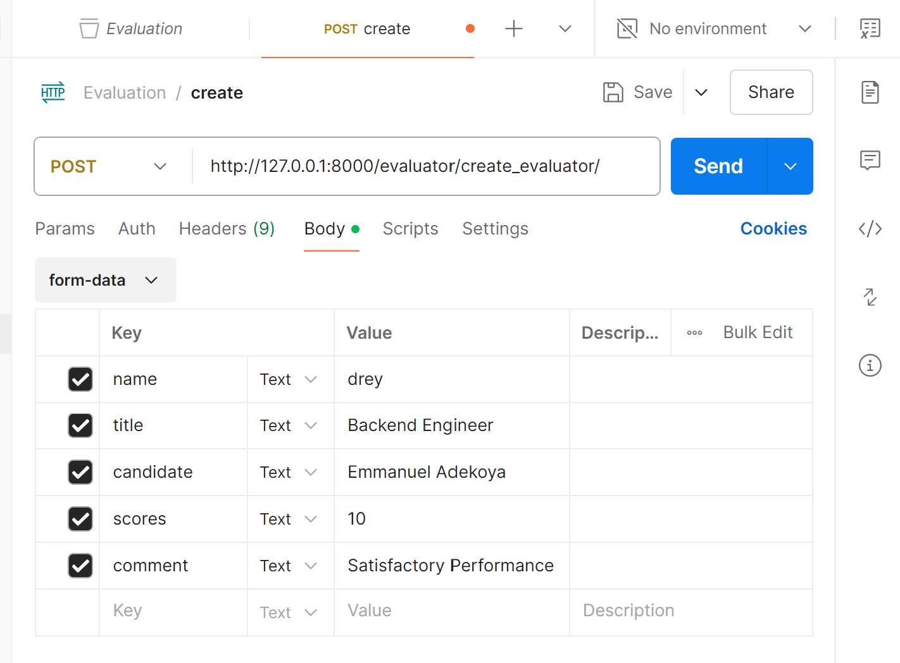
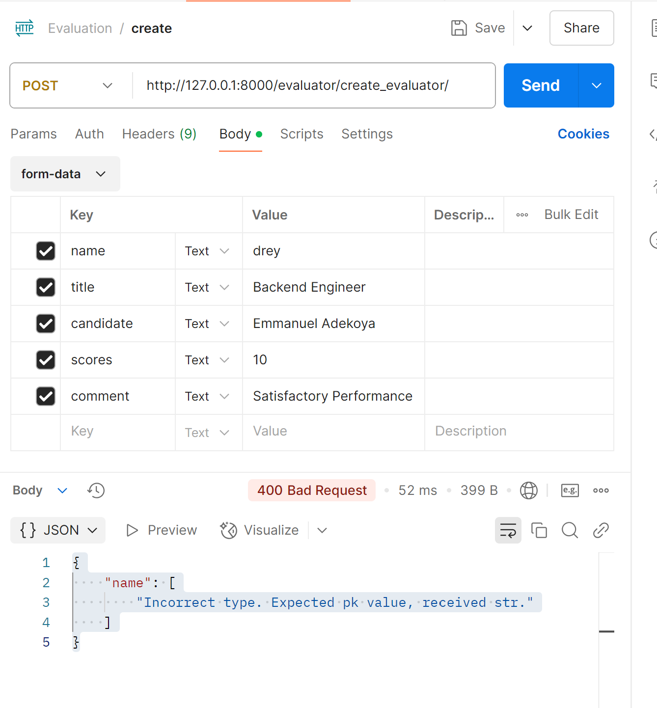
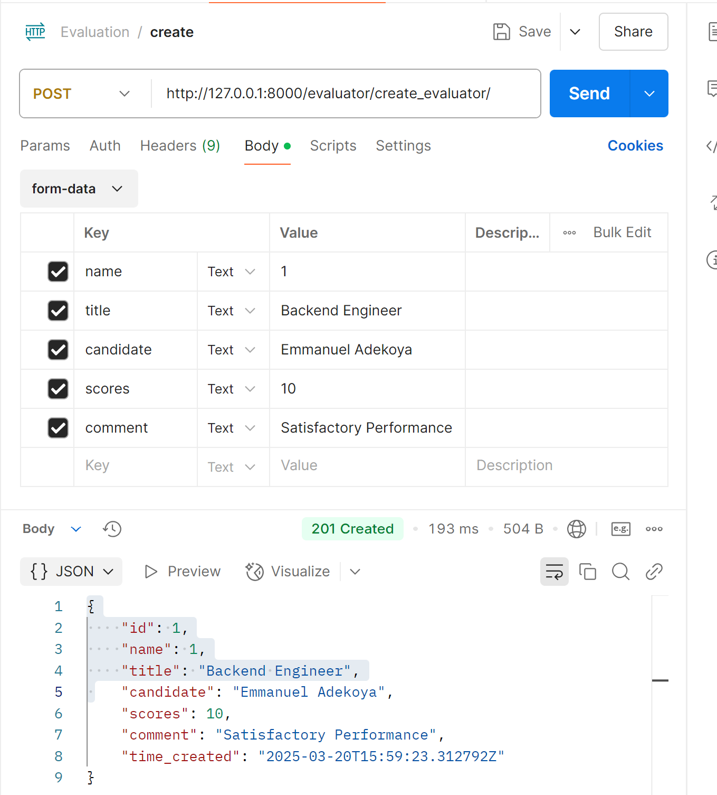
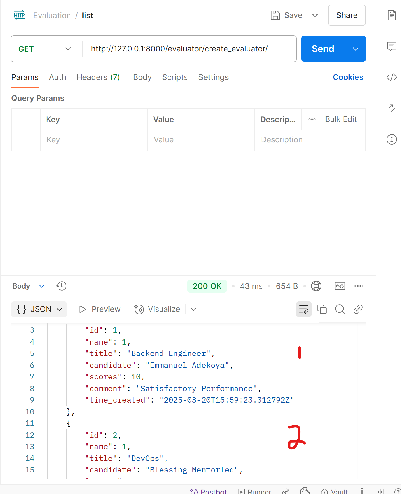
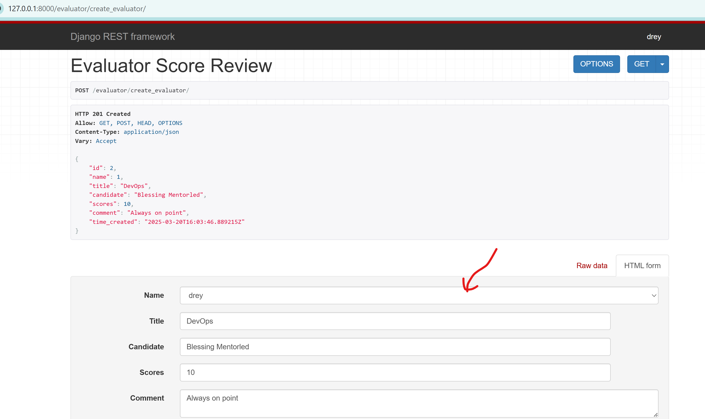

# Task5_Evaluation
# Core_Focus: 
__Create an API endpoint for evaluators to submit scores and comments.__

- ## EVALUATOR MODEL:
 This model created allows evaluators to enter interview scores after assessing their videos. Fields are: name/id of User, title, candidate, scores, comment, time_created.

- ## MODEL SERIALIZER:
 This model serializer was created for API usage: name/id of User, title, candidate, scores, comment, time_created.

- ## API Views:
 The serialized model was made an API view using restframework generic function LISTCREATEAPIVIEW to create a class of view (EvaluatorScoreReview). That allows Creating Evaluation and Listing Evaluations.

- ## ENDPOINT:
 The below shows how the endpoint was created.

- ## POST Request Endpoint- http://127.0.0.1:8000/evaluator/create_evaluator/ :

Enter your endpoint url in your Postman, select POST, fill in the fields, then select data type, then fill in acceptable values and send.

**A bad request** due to a wrong value in the name field- the name field in POSTMAN is identified by the id from/to the Database, therefore the the string "drey"must be changed to pk or id value which is an integer.

successful post request.

- ## GET Request Endpoint- http://127.0.0.1:8000/evaluator/create_evaluator/ :

**A successful GET request** to view all created Evaluation in POSTMAN.

- ## Browser API test- http://127.0.0.1:8000/evaluator/create_evaluator/ :

**This test allows both Creating(POST) and Listing(GET) requests on same page**.

NOTE: The restframework testing interface allows the Evaluator to select a User from Database, hence, accepts string in the name field as a selection.

